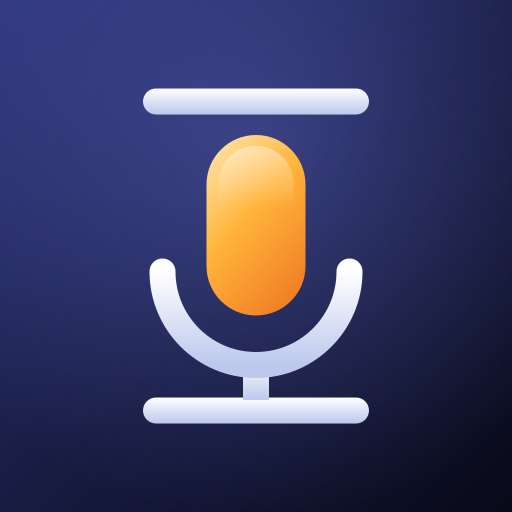
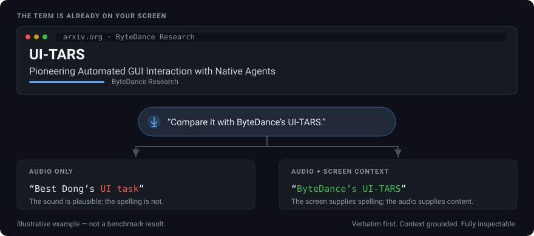

# DoNotType

A voice input method that **transcribes what you said** instead of rewriting it, and reads your
screen so it spells the hard words right.

macOS · Windows · Android · iOS. Open source, your own API key, no server in the middle.

```
        hold a key ──▶ speak ──▶ release ──▶ your words, where your cursor was
                                    │
                        grounded in what is on your screen,
                        so "koffi" stays koffi and 3.5 stays 3.5
```



That is the rule, drawn. Whether it *holds* is a separate question with a measured answer, and the
honest one is below: it holds for words and fails for digits, which is why a second screen-blind
pass supplies the numbers.

## Why

Dictation tools in this category get two things wrong.

**They rewrite.** Speak casually, get back something formal. The refinement *is* the product, so
there is no setting to turn it off and no raw transcript kept anywhere. In the tool this project
was built to replace, the only stored field is `refined_text` — going back through every schema
version, what you actually said was never saved.

**Their grounding overrules you.** A stored vocabulary of "correct" terms becomes a prior that
beats clear audio: say "Gemini 3.5 Flash" and get "Gemini 3 Flash", because that string is the one
the system already knows. Worse, a correction-fed dictionary makes it self-reinforcing.

DoNotType inverts both. The prompt is a versioned file you can read, edit and measure
([`PROMPT.md`](PROMPT.md)). Screen context is sent **raw** — no term extraction, no dictionary, no
prior transcripts — and its authority is scoped to spelling, never content.

## Status, honestly

This is a working tool with one unsolved problem, and it is the central one.

**Substitution is not fixed, and it is always a number.** Across the near-miss suite every
word-level case passes — names, acronym chains, brands, code-switched Mandarin. What fails is
digits: a version number on screen replacing the one you said. A wrong name you notice by reading
it; a wrong version number reads perfectly.

Where it bites is the text right beside your caret. With a contradicting value there, the model
took the screen's over the speaker's **75%** of the time. The mitigation that ships — a second
transcription that never sees the screen, from which the digits are taken — brings that to **20%**,
and on the reference clip it matched the no-screen baseline exactly (8% against 8%). It is on by
default, and only for dictations where the text around the caret actually contains digits.

So: better than it was, not solved. 20% is still worse than not grounding at all, and the fix costs
a second request and about 1.5 seconds.

Two caveats about the numbers themselves, since this project's argument is that claims should be
checkable. **An earlier ablation is often quoted at 36% against a 21% baseline — do not cite it.**
It predates the guard, and the recording it used is no longer in the repository, so nobody can
reproduce or audit it. And **accuracy on ordinary dictation is unmeasured**: everything above
describes deliberately adversarial cases. Method, per-channel numbers and two falsified mitigations
are in [docs/EVALUATION.md](docs/EVALUATION.md).

Everything else works and is tested. Each app is now driven by a UI test on the platform it ships
to — the iOS app is installed and exercised in a simulator, the Android app in an emulator, and the
Windows tray app is launched on a Windows runner and has to still be alive with its settings window
open before the build passes. That last one is new: for most of this project's life the Windows app
compiled and had **never been started on Windows**, and until recently the iOS app could not be
installed anywhere at all.

The iOS keyboard extension is covered where it can be. Its interface cannot be reached by a UI
test — a custom keyboard runs in its own process and its views never enter the host app's
accessibility tree — so the tests cover what it actually does instead: the shared container the app
writes transcripts into and the keyboard reads them out of, which is the part that can silently
stop working.

The dictation pipeline is now covered offline against a stub backend — a transcript is stored with
the backend that produced it, silence writes no row, a failure keeps its audio and retry recovers
it, a rewrite is stored beside the verbatim text rather than instead of it, and screen context
arrives ahead of the audio. Those run in every `swift test`, so CI protects the path a first user
walks.

Still unexercised by CI: the two ends that need hardware — microphone capture and text injection
into another app. Those are a [manual checklist](docs/MANUAL-CHECKS.md) run once per release, and
the release notes say which platforms were actually checked. And **accuracy on ordinary dictation is unmeasured**, because it needs ground truth
and nobody has verified the corpus by ear yet. `eval/make-review-sheet.py` exists to make that an
hour's work rather than a project.

## Platforms

| | Dictation | Screen grounding | WAV·MP3·M4A·Opus | CLI | Build |
|---|---|---|---|---|---|
| **macOS** | menu-bar app, hold Right ⌘ | ✅ accessibility tree + screenshot fallback | ✅ | `dnt` | `make app` |
| **Windows** | tray app, hold Right Ctrl | ✅ UI Automation | ✅ | `dnt.exe` | `cd windows && dotnet build` |
| **Android** | keyboard, records in-process | ✅ `AccessibilityService`, pull-based | ✅ | — | `cd android && gradle assembleDebug` |
| **iOS** | containing app; keyboard inserts | ❌ not possible in the sandbox | ✅ | — | `cd ios && xcodegen generate` |

All four send the **same** `PROMPT.md`, copied into each bundle at build time rather than
duplicated, so no platform can quietly drift from what the evaluation measures. All four also
transcribe recordings you already have, in all three modes, and write a readable log — see
[docs/CLI.md](docs/CLI.md) for what differs and why.

iOS is the odd one out for a reason: a keyboard extension cannot open a microphone — "Allow Full
Access" grants network and a shared container, not the mic. See [ios/README.md](ios/README.md).

That also makes iOS the one platform where a **speech recognition** backend costs nothing: there is
no screen grounding to give up, so Deepgram or Voxtral are simply several times faster and cheaper
than a model, with no trade at all. All four platforms let you pick the backend, and store the key
and model per provider so switching is one dropdown.

## Install

Prebuilt macOS, Windows and Android artifacts are attached to each
[release](../../releases), with a `.sha256` beside every one. Both desktop archives also contain
`dnt`, the command line. iOS is not distributed — it needs a provisioning profile, so build it from
source.

If a build was made without signing secrets, macOS refuses to open it on a double-click: right-click
the app and choose **Open** once, and Gatekeeper asks instead of refusing.

Homebrew and winget manifests are written and waiting in [`packaging/`](packaging/); neither is
submitted, because both registries want a signed installer and a release history first.

From source on macOS:

```bash
git clone https://github.com/bojieli/DoNotType && cd DoNotType
export GEMINI_API_KEY=...       # or add it in Settings
make app && make install        # builds, signs, installs to /Applications
```

On first launch it walks you through Accessibility and Microphone permissions, and re-checks them
every launch — macOS revokes Accessibility whenever an app's signature changes.

## How it works

**Two-phase capture.** At hotkey-down it takes a cheap snapshot (app identity, cursor state) and
opens an upload session. While you are still speaking it runs the expensive accessibility walk
(10,000 characters, 500 ms cap) and, if the tree comes back thin, captures the focused window.
Everything expensive happens during the recording, because that time is free. What you feel is only
what happens after you let go.

**Upload with a fallback.** The finished recording is uploaded and referenced by URI, turning
megabytes of base64 into a few hundred bytes of JSON. Anything that fails falls back to inline
rather than failing the dictation — a flaky network should cost latency, never words.

**Offline queues rather than fails.** Being offline is detected *before* a request is spent, so the
dictation goes straight to history and sends itself when you reconnect.

**Failed dictations keep their audio** until they succeed. Otherwise "Retry" would be a button that
cannot work.

**Undo is cheap because the verbatim transcript is always kept.** A wrong transcript, or a rewrite
that came out too formal, is one key away from being fixed — `⌘⌥Z` swaps in what you actually said.
A tool that discards the original cannot offer this at all, which is the difference being argued.

More in [docs/ARCHITECTURE.md](docs/ARCHITECTURE.md).

## Files, modes, and a command line

The hotkey covers speech you are about to make. Recordings you already have — a voice memo, a call,
an interview — go through the same pipeline on **all four platforms**: **Transcribe a Recording…**
in the macOS menu, a **Recordings** tab on Windows, a screen in the Android and iOS apps, or the
CLI:

```bash
dnt transcribe interview.m4a                          # verbatim, to stdout
dnt transcribe standup.wav --mode summary:actions     # decisions and next steps
dnt transcribe *.m4a --output notes/ --save-history
```

Three modes, in both places:

| | | |
|---|---|---|
| **verbatim** | word for word, at the chosen fidelity | one request |
| **rewrite** | formal, concise or bullets — may never lose a fact | two |
| **summary** | brief, key points, or decisions and next steps | two |

**The verbatim transcript is always produced and always kept**, including under a summary, where it
is the only way to check what was dropped. The GUI shows it behind a toggle; `--output` writes it to
`name.verbatim.txt` beside the result; `--json` carries both.

Summarising is the one stage in this codebase allowed to discard content, so it is not a rewrite
style — it has its own block in `PROMPT.md`, its own type, and no path to it from a rewrite. Rule 1
of the rewrite block is *never remove a fact*, and a summary style sitting in that list would be one
entry quietly exempt from it.

Rewriting and summarising need a language model. With a recogniser selected the CLI says so before
uploading anything, and can split the work — audio to the fast recogniser, text to a model:

```bash
dnt transcribe long-meeting.m4a --mode summary:bullets --provider xai --text-provider gemini
```

`dnt` also answers the questions that previously needed the app open, or the source:

```bash
dnt doctor --probe        # keys, prompt, history, audio support, one live request
dnt providers             # which backends have a key, and which are models at all
dnt logs --follow         # what the app is doing right now
dnt history retry --all   # re-send what failed, with its stored audio and context
dnt prompt show           # the exact instruction a request will carry
```



Every line in that image is real output. There is no `dnt transcribe` frame in it for the same
reason there are no invented numbers anywhere else here: its output needs a configured backend, and
a repository has no key, so any transcript shown would have had to be made up.

Full reference, including the logging: [docs/CLI.md](docs/CLI.md).

## Logging

Structured, levelled, and written to a file you can attach to an issue — on every platform, with a
viewer in the app so turning the level up never means relaunching from a terminal. At `debug` every
provider request, the grounding route each backend was given, every retry and every fallback is a
line.

That matters most where it is least convenient. A Mac or Windows user can open a file; on Android
logcat needs a cable and a computer, and on iOS there is no shell at all — so both share the log out
instead. Each platform also keeps its native sink (`os.Logger`, logcat), so nothing that used to be
visible stopped being.

Two things never reach it. **Your words**: transcripts and screen text are withheld by default, so a
line records that a 412-character transcript came back, not what it said — `DNT_LOG_CONTENT=1` opens
that door and the app says out loud when it is open. **Your key**: every resolved key is registered
for masking before the first request, and anything else key-shaped is caught by pattern.

## Settings

- **Providers and keys** — Gemini (default), any OpenAI-compatible gateway, a server you run
  yourself (vLLM, llama.cpp), or a speech recognition service (Deepgram, Mistral Voxtral, xAI),
  with a live connection test. Keys **and models are stored per provider**, so switching backends
  to compare them is one dropdown rather than a re-typing exercise. Keys live in the Keychain /
  DPAPI / private prefs, never in a config file.
- **Recognition services are a different trade, and the app says so.** They return a transcript in
  around 1.2 s against 6.5 s for a model, and cannot read your screen or rewrite. Selecting one
  states that under the picker rather than leaving grounding controls that quietly do nothing.
  Spelling hints from the screen are **not offered**: measured, they made transcripts worse, by
  feeding the recogniser whatever was on screen — including the term you did not say. Without them
  xAI scores **15/48** on the near-miss suite against native Gemini's **43–44/48**, at 1.19 s
  against 5–60 s — an order of magnitude faster, and much less accurate on exactly the identifiers
  that suite is built from. It is the default anyway, because that suite is adversarial by
  construction and the choice was made on the ordinary-dictation corpus, where it is the fastest
  backend that does not fall over on Chinese; Deepgram cannot transcribe Chinese under any
  autodetecting setting, failing 44 of 68 Mandarin clips outright. Voxtral and xAI both handle
  Mandarin and English together. Measured in [docs/EVALUATION.md](docs/EVALUATION.md).
- **Fallback** — an optional second backend, started only once the primary has clearly stalled.
  The first-party Gemini API is the most accurate measured and its latency is *bimodal*: six
  sequential requests for one three-second clip took 4.9, 61.6, 50.5, 5.8, 5.9 and 30.2 s. The
  fallback bounds that tail. You pick both services, both keys and how long the primary gets
  alone; history records which one actually answered, because a tool whose transcript quality
  varied invisibly would not be worth trusting.
- **Hotkey** — which key, whether a tap toggles or a hold talks, and an optional **second key
  bound to a rewrite** (formal, concise, bullets) for when you want an email rather than a
  transcript. Your main key always stays verbatim.
- **Shortcuts** — `⌘⇧Z` undoes the last insertion, `⌘⌥Z` reverts a rewrite to what you actually
  said, `⌘⌃V` pastes the last transcript again.
- **Audio** — pin a microphone rather than following the system default; start/stop tones are on
  by default and can be disabled.
- **Fidelity** — `raw`, `light` (default), `tidy`. Even `tidy` only changes typography, never words.
- **Grounding** — on/off, screenshot fallback, and two blocklists evaluated *before* capture.
- **History** — search, filters, per-item retry and delete, retention policy, per-dictation
  timings, and a **Context Inspector** showing exactly what was sent with any dictation.
- **Stats** — median and p95 wait, wait per second spoken, success rate, retries, and a per-model
  breakdown measured on your microphone and your network rather than on a vendor's benchmark.
- **Prompt** — edit the contract in place on any platform, validated before saving, restorable to
  the shipped default.
- **Logs** — the last few thousand events, filterable by level and text, with the recording level
  beside them and one button to reveal the file. Transcripts stay out of it unless you say
  otherwise, and the panel says so when you have.

## Evaluation

The failure this project is about is invisible to ordinary assertions: a substituted version number
reads as a correctly transcribed technical term. So there is a measurement layer.

```bash
swift test                                    # 170 unit tests, no network
DNT_INTEGRATION=1 swift test                  # live API on real speech
swift run dnt-eval suite eval/nearmiss        # near-miss suite
swift run dnt-eval ablate                     # compare designs on fidelity and latency
./eval/model-sweep.sh                         # compare model versions
```

Historical runs found `gemini-3.6-flash` strongest on the reference clip, while older Gemini models
misheard its version number and `openai/gpt-audio` sometimes replied conversationally instead of
transcribing. The exact real-speech fixtures are not present in this checkout, so those figures are
handoff context rather than a currently reproducible benchmark; the ignored synthetic stand-ins are
not valid replacements. Current downloaded-checkpoint tests use separately labeled public real
audio. Full status in [docs/MODELS.md](docs/MODELS.md); method in
[docs/EVALUATION.md](docs/EVALUATION.md).

## Privacy

No server of ours, no telemetry, no analytics. Requests go straight from your machine to the
provider you configured, with `store: false` set. The blocklist is evaluated before capture and
ships non-empty. The Context Inspector shows exactly what was sent with any dictation.

Read [SECURITY.md](SECURITY.md) for what the app can see, where keys live, and an honest threat
model — including prompt injection, which this design has an unusually direct surface for.

## What this will never do

Some of what follows sounds like a missing feature. Each one is a decision, and most were reached by
building the thing and measuring it.

**Rewrite you by default, or discard what you said.** The raw transcript is produced first, stored
first, and recoverable — under a rewrite, under a summary, on every platform. A mode that transcribed
and polished in one request would have no verbatim output to keep, so there isn't one.

**Learn a vocabulary from your corrections.** A stored list of "correct" terms becomes a prior that
beats clear audio, and a correction-fed one is self-reinforcing: that is the specific failure this
project was built against. The one feature of that shape — keyterm biasing — was implemented,
measured, found to regress three cases per run, and taken out of the settings.

**Put a server in the middle.** No account, no sign-in, no subscription, no telemetry, no analytics,
no crash reporting. Your key, your machine, the provider's API. That also means no server-side
history, no sync, and no "recover my transcripts" — the price of the same decision.

**Log your words.** Transcripts and screen contents stay out of the log file unless you switch them
on, and the app says out loud when you have.

**Ship a quality claim without a number.** Changes to `PROMPT.md`, the context format, the budgets or
the default backend need before/after measurements. This has already reversed three plausible
mechanisms, and one of the reversals removed a feature.

**Truncate something and say nothing.** If a list is capped or a budget drops content, the interface
says so. A history list capped at 20 with nothing said reads as "this is all of it".

**Ground on iOS.** Not a roadmap item — nothing in the sandbox lets one app read another's content,
and unlike macOS accessibility or Android's `AccessibilityService` there is no user-grantable escape
hatch. It is listed as ❌ above and will stay that way.

## Contributing

Changes to `PROMPT.md` or the context format need **a measurement, not an argument**. Three
plausible-sounding changes in this project's history were measured and did the opposite of what was
predicted. See [CONTRIBUTING.md](CONTRIBUTING.md).

## Documentation

| | |
|---|---|
| [PROMPT.md](PROMPT.md) | the transcription contract, and its measured changelog |
| [CONTEXT_FORMAT.md](CONTEXT_FORMAT.md) | part order, delimiters, caps, truncation direction |
| [docs/ARCHITECTURE.md](docs/ARCHITECTURE.md) | how the pieces fit, and which decisions were measured |
| [docs/LOCALIZATION.md](docs/LOCALIZATION.md) | translating the interface, and why the prompt is never translated |
| [docs/MANUAL-CHECKS.md](docs/MANUAL-CHECKS.md) | the four checks a machine cannot do, run once per release |
| [docs/CLI.md](docs/CLI.md) | `dnt`: file transcription, history, diagnostics — and the logging |
| [docs/EVALUATION.md](docs/EVALUATION.md) | how quality is measured and what the numbers say |
| [docs/MODELS.md](docs/MODELS.md) | which models and providers can actually do this job |
| [docs/GPU-TESTING.md](docs/GPU-TESTING.md) | running open-weight models locally, and what to measure |
| [docs/RELEASING.md](docs/RELEASING.md) | cutting a release, and which signing secrets change what |
| [Resources/Icon/README.md](Resources/Icon/README.md) | the app icon, and the one file every platform's copy is rendered from |
| [PLAN.html](PLAN.html) | the original reverse-engineering survey this design came from |

## License

[MIT](LICENSE).
